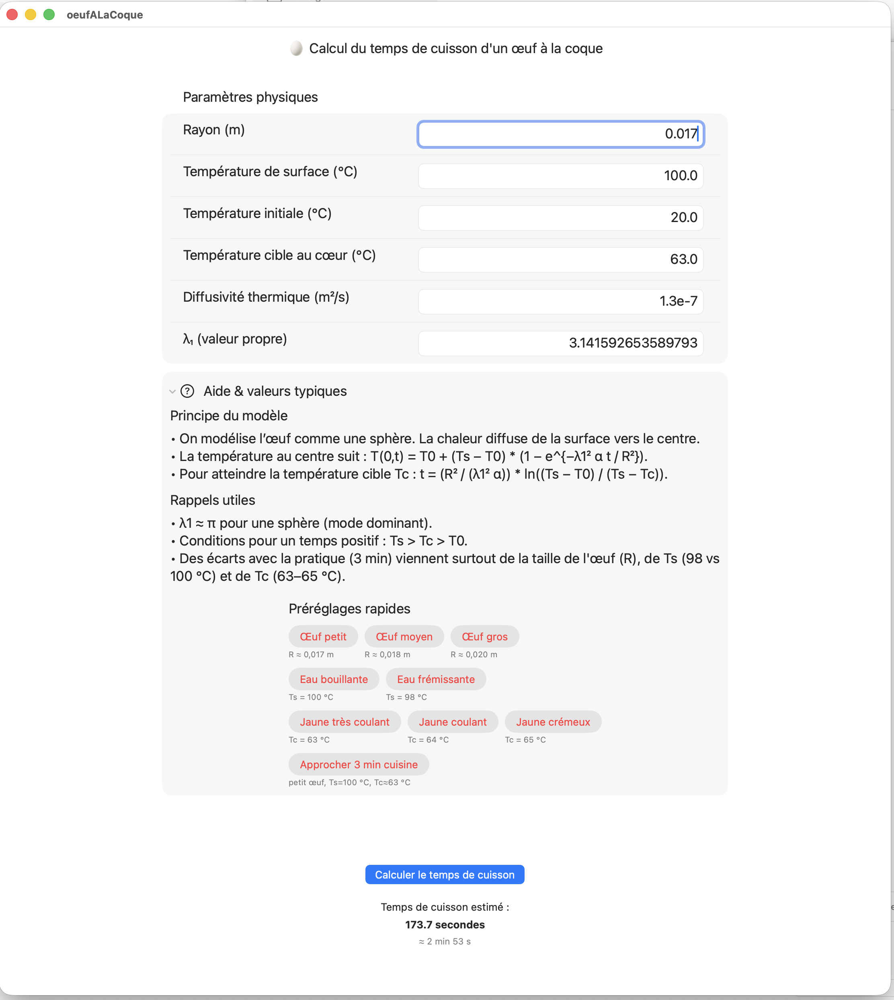

# 🥚 Oeuf à la coque – Modélisation thermique en SwiftUI

Ce petit projet SwiftUI calcule le **temps de cuisson d’un œuf à la coque**
à partir du modèle de diffusion thermique dans une sphère homogène.

L’équation utilisée provient de la solution approchée de la chaleur au centre de la sphère :

\[
t = \frac{R^2}{\lambda_1^2 \alpha} \ln\left(\frac{T_s - T_0}{T_s - T_c}\right)
\]

où :

| Symbole | Signification | Exemple |
|----------|----------------|----------|
| R | Rayon de l'œuf (m) | 0.02 |
| α | Diffusivité thermique (m²/s) | 1.3×10⁻⁷ |
| λ₁ | Valeur propre (π pour une sphère) | 3.1416 |
| T₀ | Température initiale de l'œuf (°C) | 20 |
| Tₛ | Température de l’eau (°C) | 98–100 |
| T_c | Température cible au cœur (°C) | 63–65 |

---

## 🎯 Objectif

- Estimer la durée nécessaire pour qu’un œuf atteigne une température cible au centre.  
- Permettre de tester différentes conditions (taille, température de l’eau, etc.).  
- Fournir une base éducative simple reliant **physique** et **programmation Swift**.

---

## 💡 Exemple

Pour un petit œuf (R = 0.017 m) plongé dans de l’eau bouillante (100 °C),  
température initiale 20 °C et cible 63 °C :

→ **t ≈ 180 s** soit **3 minutes**  
(cuisson “œuf à la coque” typique, blanc ferme et jaune coulant)

---

## 🧰 Technologies
- Swift 5.10+
- SwiftUI
- Xcode 16+

---

## 📁 Structure du projet
OeufALaCoque/  
├── OeufALaCoqueApp.swift  
├── ContentView.swift  
└── Assets/  

---

## 🖼️ Aperçu

### vue de l'application :

---

## 📖 Auteurs
Projet pédagogique réalisé par **Philippe86220** avec l’assistance de **ChatGPT (GPT-5)**.  
Ce dépôt a vocation à servir de **référence personnelle** et d’outil d’étude.

---

## 🪪 Licence
Ce code peut être réutilisé librement à des fins pédagogiques ou personnelles.
